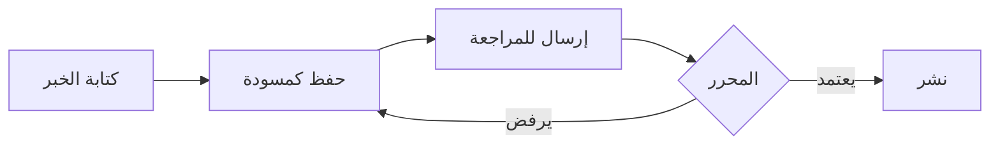

# دليل العمليات التحريرية — الصوت المحلي

## 1. سير العمل (Workflow)

### أ. سير عمل المراسل (REPORTER)

**صلاحيات المراسل:**
- إنشاء خبر جديد (حالة: مسودة)
- تعديل أخباره الخاصة في حالة المسودة
- إرسال الخبر للمراجعة
- عرض أخباره في مساحة العمل

**ممنوع على المراسل:**
- نشر خبر مباشر
- تعديل خبر بعد الموافقة عليه
- حذف خبر
- إدارة المستخدمين أو الوسائط

### ب. سير عمل المحرر (EDITOR)

**صلاحيات المحرر:**
- مراجعة الأخبار في حالة "قيد المراجعة"
- الموافقة على الخبر (نقل إلى "معتمد")
- إرجاع الخبر مع تعليقات (نقل إلى "مسودة")
- رفع الوسائط
- إدارة الدليل الاقتصادي
- إدارة الإعلانات

**خطوات المراجعة:**
1. فتح الخبر في وضع المعاينة
2. التحقق من:
   - دقة المعلومات
   - جودة الصورة
   - التصنيف والمنطقة الصحيحة
   - عدم وجود أخطاء إملائية
   - توافق العنوان مع المحتوى
3. الموافقة أو الإرجاع مع ملاحظات

### ج. سير عمل المدير (ADMIN)

**صلاحيات المدير:**
- نشر الخبر المعتمد
- أرشفة الخبر
- حذف الخبر
- إدارة المستخدمين
- عرض سجل التدقيق
- جميع صلاحيات المحرر

**مسؤوليات النشر:**
- التحقق النهائي قبل النشر
- جدولة النشر في الأوقات المناسبة
- التأكد من صحة الرابط الدائم (slug)
- إضافة الخبر إلى الصفحة الرئيسية إذا كان مهماً

---

## 2. سياسة النشر

### المعايير التحريرية
- **المصداقية**: يجب توثيق مصدر كل خبر
- **الدقة**: التحقق من الأسماء والتواريخ والأماكن
- **الحياد**: فصل الخبر عن الرأي
- **الجهوية**: التركيز على الشأن المحلي (تيارت، السوقر، قصر الشلالة)

### هيكل الخبر المثالي
1. **العنوان**: واضح، دقيق، لا يتجاوز 200 حرف
2. **الملخص**: جملة أو جملتين تشرح جوهر الخبر
3. **المحتوى**: مقدمة + تفاصيل + خاتمة
4. **الصورة**: صورة واحدة على الأقل بدقة 1200x630 بكسل
5. **التصنيف**: تصنيف رئيسي واحد
6. **المنطقة**: المنطقة المعنية بالخبر
7. **الوسوم**: 3-5 كلمات مفتاحية

### حالات الخبر
| الحالة | الوصف | الإجراء المسموح |
|--------|-------|-----------------|
| مسودة | قيد الكتابة | تعديل، إرسال للمراجعة |
| قيد المراجعة | بانتظار المحرر | مراجعة، موافقة، رفض |
| معتمد | جاهز للنشر | نشر، أرشفة |
| منشور | متاح للجمهور | أرشفة |
| مؤرشف | غير ظاهر | لا إجراء |

---

## 3. سياسة التصحيح

### متى يتم التصحيح؟
- خطأ في المعلومة
- خطأ في الإملاء
- خطأ في اسم شخص أو مكان
- تحديث معلومة بعد النشر

### إجراءات التصحيح
1. فتح الخبر المنشور
2. إجراء التصحيح في المسودة
3. إضافة تعليق في أسفل الخبر:
   > "تم التصحيح في [تاريخ]: [وصف التصحيح]"
4. إعادة النشر

### التصحيحات الجوهرية
إذا كان الخطأ جوهرياً:
1. سحب الخبر (نقل إلى مسودة)
2. التصحيح الكامل
3. إعادة إرسال للمراجعة
4. إعادة النشر مع إشعار في أول الخبر بأنه تم تحديثه

---

## 4. إدارة الأزمات الإعلامية

### بروتوكول التغطية العاجلة
1. إشعار المدير فوراً
2. إنشاء خبر عاجل في أسرع وقت
3. تمريره مباشرة للمحرر (تجاوز المراجعة إذا لزم الأمر)
4. النشر بأقل تأخير
5. تحديث مستمر حسب تطور الأحداث

### ما لا ينشر أبداً
- أخبار كاذبة أو غير مؤكدة
- محتوى مسيء أو عنصري
- انتهاك للخصوصية
- دعاية سياسية
- محتوى محمي بحقوق الطبع

---

## 5. المصطلحات

| المصطلح | المعنى |
|---------|--------|
| REPORTER | مراسل ميداني — يكتب الأخبار ويرسلها للمراجعة |
| EDITOR | محرر — يراجع الأخبار ويوافق عليها |
| ADMIN | مدير — ينشر ويدير المنصة |
| مسودة | خبر غير مكتمل |
| قيد المراجعة | خبر بانتظار المحرر |
| معتمد | خبر جاهز للنشر |
| منشور | خبر متاح للجمهور |
| مؤرشف | خبر مخفي عن الجمهور |
